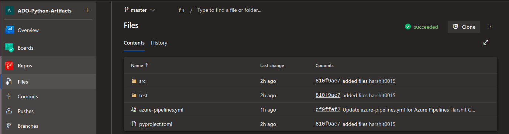
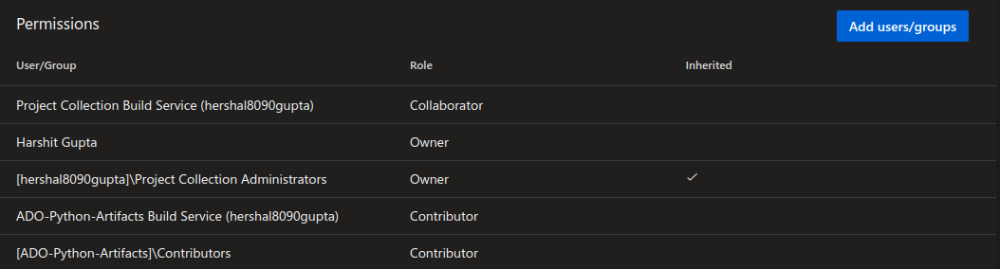
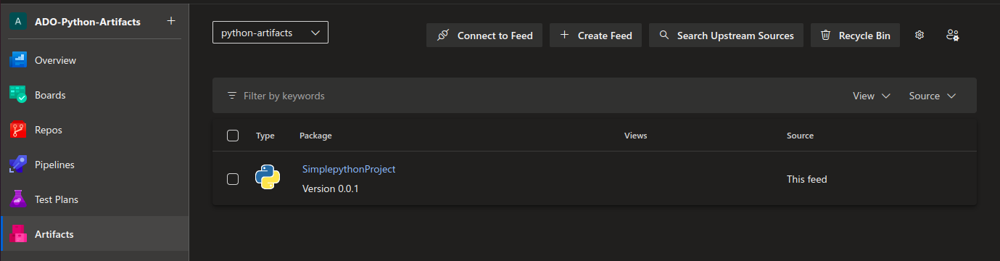

# Short Description about this template

In this techhub we are going to build and push  the artifacts into the ADO Artifact ,Here i am using a simple python project.

# Steps for Execution 
1. clone the repository.
2. start the agent to run the pipeline.

As you can see in the below image after running the sucessfull pipeline the Artifact is stored into the ADO Artifacts.

